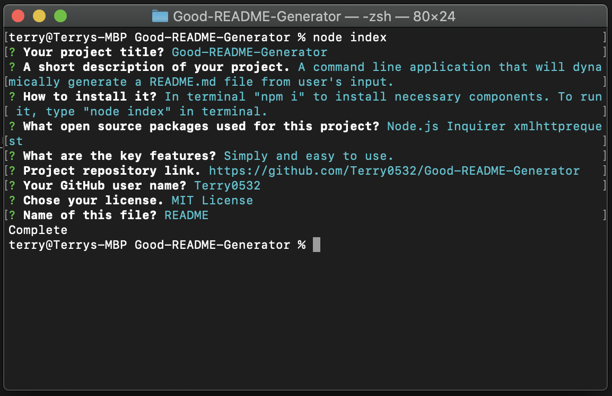
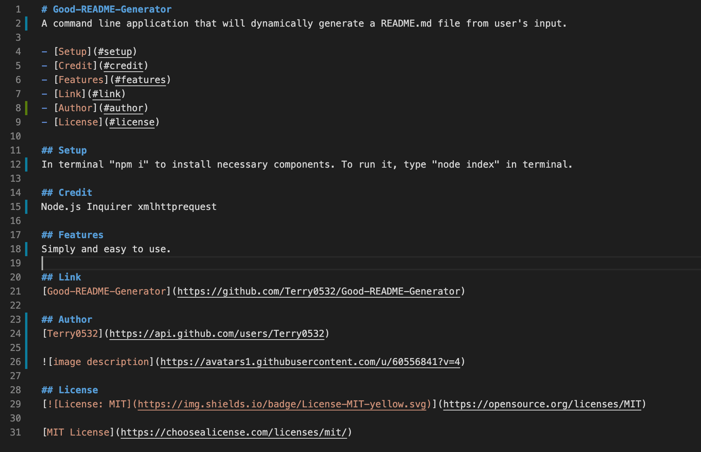

# Good-README-Generator
A command line application that will dynamically generate a README.md file from user's input.

- [Setup](#setup)
- [Credit](#credit)
- [Features](#features)
- [Link](#link)
- [License](#license)

## Setup
In terminal "npm i" to install necessary components. To run it, type "node index" in terminal. 

## Credit
Node.js
Inquirer
XMLHttpRequest

## Features
Simple and easy to use. 

## Link
[Good-README-Generator](https://github.com/Terry0532/Good-README-Generator)

## Screenshot

## License

[MIT License](https://choosealicense.com/licenses/mit/)